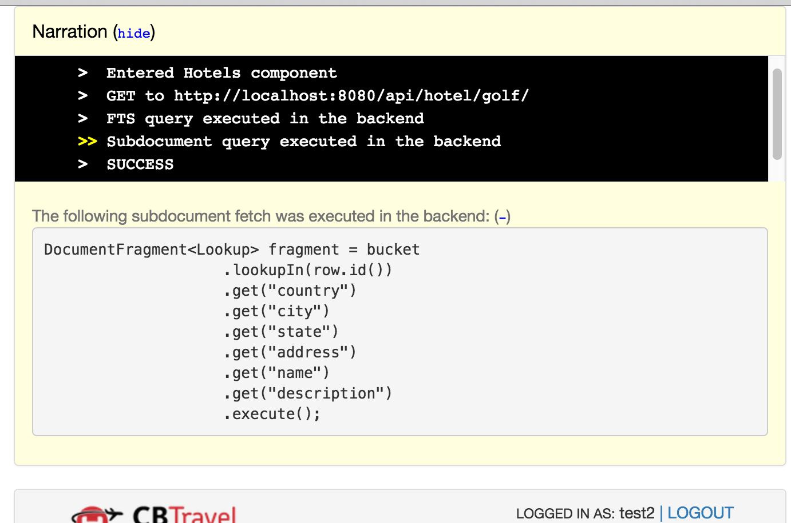
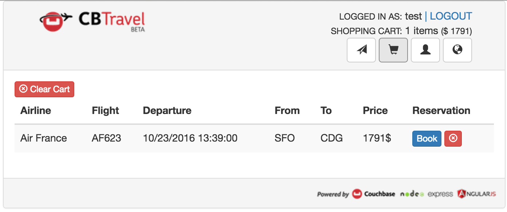

# Travel Sample Application

Couchbase Travel is a sample web application that demonstrates how to interact with the Couchbase query services via the SDKs.

Each SDK comes with its own implementation of the backend for the application. You can download the complete source code and then build and run the app. While the app runs, you can get a peek of what is happening in the backend via the "Narration", a console like UI element that can display [N1QL](https://www.couchbase.com/products/n1ql) queries, and interactions with the back-end through the API.



The documentation for the travel app illustrates the [data model](https://developer.couchbase.com/documentation/server/4.5/travel-app/travel-app-data-model.html) and walks through the N1QL and [Full Text Search](https://developer.couchbase.com/documentation/server/current/sdk/full-text-search-overview.html) (FTS) queries used to select flights and search for hotels.

## Generic Set Up

You'll need:

- Your favorite editor or IDE.
- Your SDK of choice and its specific dependencies. This walkthrough shows the Java SDK in action.
- A local installation of Couchbase Server, with at least one node with **Data**, **Query**, **Index** and **Full Text** search services in the cluster (see below).
- The travel-sample bucket loaded - at installation, or later (see below).

For this tutorial run Couchbase Server and the travel sample app on the same machine. [Multidimensional Scaling](https://developer.couchbase.com/documentation/server/current/clustersetup/services-mds.html) (MDS) allows data, query, and indexing workloads, to be scaled separately, and is a great feature to try - but later.

Download [Couchbase Server 4.6](https://www.couchbase.com/downloads) and install it. As you follow the download instructions and setup wizard, make sure you keep all the services (**Data**, **Query**, and **Index**) selected, and also select **Full Text**.


Make sure also to install the sample bucket named `travel-sample` which contains the data used in this tutorial.


If you already have Couchbase Server 4.5 or later installed but did not install the `travel-sample` bucket (or you installed it from a 4.0 version), open the Couchbase Web Console and select **Settings > Sample Buckets**. Select the **travel-sample** checkbox, and then click **Create**. A notification box in the upper-right corner disappears when the bucket is ready to use.

You can also install from the command line, with the **cbdocloader** tool, replacing `/opt/couchbase/bin/cbdocloader` with `/Applications/Couchbase Server.app/Contents/Resources/couchbase-core/bin/cbdocloader` on MacOS-X:

```bash
 /opt/couchbase/bin/cbdocloader -n localhost:8091 -u Administrator -p Pass -b travel-sample -s 100 /opt/couchbase/samples/travel-sample.zip 
```

Note, that this tutorial relies on Couchbase's new FTS feature, which must be enabled at installation time (unless you've installed the 5.0 Beta). If you've already installed a local version (rather than downloaded a Docker instance), and not checked the FTS option during install, you'll need to re-install. Check the **Full Text** box as in the Step 1 screenshot above, and then check the **travel-sample** bucket in Step 2. Use [cbbackup](https://developer.couchbase.com/documentation/server/current/cli/backup-cbbackup.html) to save data first, if you've got so far as to have made changes, then restore data after re-install.

Now, in order to be able to search for hotels, you must create an FTS index called `hotels` in the travel-sample bucket. Go to **Indexes > Full Text > New Full Text Index** and create the `hotels` index:


Note that the index mapping could be [better tuned](https://blog.couchbase.com/full-text-search-enhancements-in-couchbase-server-4-6/), but a generic mapping will work fine for this example.

## Using the Travel App

The travel app will work with any SDK. We're using Maven with the Java SDK. Follow along with us here, then try your preferred SDK in [C](https://developer.couchbase.com/documentation/server/4.6/sdk/c/start-using-sdk.html), [Go](https://developer.couchbase.com/documentation/server/4.6/sdk/go/start-using-sdk.html), [.NET](https://developer.couchbase.com/documentation/server/4.6/sdk/dotnet/start-using-sdk.html), [Node.js](https://developer.couchbase.com/documentation/server/4.6/sdk/nodejs/start-using-sdk.html), [PHP](https://developer.couchbase.com/documentation/server/4.6/sdk/php/start-using-sdk.html), or [Python](https://developer.couchbase.com/documentation/server/4.6/sdk/python/start-using-sdk.html) afterwards.

### Installation

Get the latest Java SDK from GitHub, then let Maven do the heavy lifting:

```bash
$ git clone https://github.com/couchbaselabs/try-cb-java.git
$ cd try-cb-java
$ mvn spring-boot:run
```

If you get an error message, note that some platforms - such as Debian - need you to run `sudo mvn spring-boot:run`.  
Now open **127.0.0.1:8080** in your browser. If there is a problem check that Couchbase is running, and look for messages beneath your `mvn` command mentioning `Tomcat` and a port number, in case you already have a service running on port 8080.

### Finding a Flight

1. Open a browser and navigate to the login URL that was displayed when you started the app.
2. Sign in to Couchbase Travel by providing your credentials, or create a new account. The email address that you use will not be validated when run with a sample bucket, so you can make up something easy to remember. Note that the log-in will usually expire after an hour or so, depending on the backend used:

	

3. Find a flight:


In the **AIRPORT OR CITY** section, enter an airport code or city name in the **From** and **To** fields.
4. In the **TRAVEL DATES** section, enter **Leave** and **Return** dates in MM/DD/YYYY format. 
5. Click **Find Flights**.  
The app displays the available flights for the outbound and return legs of the trip. 

You can click on the queries in the Narration box to see the N1QL command that was executed. You can also see them in the terminal from where you ran Maven.  
Select one or more flights to add to your cart by clicking the **Choose** button next to each flight.  


Now you have flights stored locally in your cart. Go to the **Cart** page and review your flights:

1. Click on the "cart" icon button in the navigation bar, top right.
2. See that the number of flights in the cart and the total cost are displayed in that navigation bar.
3. Review the flights in your cart, and book one by clicking on the **Book** button next to it.



4. The flight is now booked, as confirmed by a message on the page.

The flights that you've booked are stored in the backend. You can see which flights you've booked by navigating to the "user" page ("head and shoulders" icon). The backend uses authentication to control access to the endpoints for booking and listing flights.


### Finding a Hotel

To search for an hotel, click on the "earth" icon in the navigation bar (rightmost icon). Click on the **Find Hotels** button and you will see the first 100 hotels. Refine your search using the input boxes, either by keyword (such as `historic` or `golf`), geographically, or both.


Note the `GET` value used to interact with the API in the Narration - such as `http://localhost:8080/api/hotel/historic/United Kingdom/` - you can use this in your own clients, to fetch the JSON value returned.

## Using CBQ

You can browse and access documents in Couchbase using browser and command line tools without writing any code. This can be helpful to you if you simply wish to inspect cluster data without writing code. You can access individual documents using the command line and web console.

### Using the Command-Line Query Shell (cbq)

You can use the **cbq** program as a command line query shell to issue N1QL queries in Couchbase. cbq is available on all cluster nodes and does not require a separate installation. Simply run cbq from the Couchbase installation directory - `/opt/couchbase/bin/cbq` on GNU/Linux and `/Applications/Couchbase Server.app/Contents/Resources/couchbase-core/bin/cbq` on MacOS-X. Once in the query shell, you should be greeted by a **cbq>** prompt. You can now issue any N1QL query; try this one (and vary `LIMIT`):

```bash
$ cd /opt/couchbase/bin/
$ ./cbq -c travel-sample:pass
cbq> SELECT airportname FROM `travel-sample` WHERE airportname IS NOT NULL LIMIT 1;
```

## Web Console Document Access

You can use the Web Console to view, edit, and create JSON documents up to 2.5KiB in size. To access documents using the Web Console:

1. Navigate your browser to a cluster node. Type the address of the cluster with the admin port (8091). Use your username (usually Administrator). The password is the password you used when setting up the cluster.
2. Once logged in, go to the **Data Buckets** section.

	

3. Click on the **Documents** button of the default bucket:

	
	
4. To retrieve a document, type in the `Document ID` and click on **Lookup ID**. For example, if you logged into the test application with test@test in the email field, then `user::test@test` will be a valid `Document ID` - the IDs should be listed after you click **Documents**. Type in the ID to open the document edit page:

	
	
	
	
5. To create a new document, return to the **Documents** section and click on **Create Document**.

	

6. You’ll be prompted to enter a `Document ID`.

	

7. Once created, you can now edit your document. Don't forget to **Save** when done.

	

## Related Links

- [Backup and Restore](https://developer.couchbase.com/documentation/server/4.6/backup-restore/backup-restore.html) - if you needed to re-install for FTS.

-  The [N1QL Language Reference](https://developer.couchbase.com/documentation/server/4.6/n1ql/n1ql-language-reference/index.html) contains details about N1QL syntax and usage. 

- The [Travel App Data Model](https://developer.couchbase.com/documentation/server/4.5/travel-app/travel-app-data-model.html)
